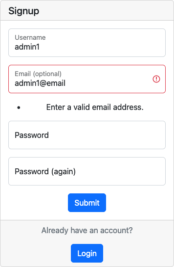
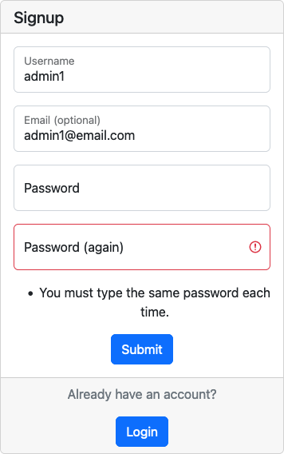

# Cool School

## Features

Web application has the following pages:
- home page
- login page
- registration page
- profile page
- edit profile page
- profile list page
- user profile page
- create group page
- group list page
- group detail page
- update group page
- delete group page
- update group host page
- create session page
- session detail page
- update session page
- delete session page
- update session admin page
- update game score page
- session invite page
- update session players page
- delete session invite page
- user session invite page
- user friend request page
- update session invite page
- update user session invite page
- delete user session invite page
- update friend request page
- delete friend request page

**Navbar**

Navbar has the following links:
- home page
- list view search form
- login

The simplistic design of the navbar is based on the decision to make the use of the webapp easy for the user.

When the user is logged in, the user navbar is displayed.

- 

User Navbar has the following buttons:
- Group Search (which leads to the group list page)
- Group Detail (which leads to specific group page)
- Session Detail (which leads specific session page)
- Session Invites (which leads to logged in users session invites page)
- Find Friends (which leads profile list page)
- Pending Invites (which leads to logged in users friend invites page)
- Profile (which leads to the user profile page)

The user navbar is made of icon with bootstrap tooltip on hover

**Footer**

Footer has the following sections:

- Code copyright on left:

- app logo in center

- links to the GitHub and LinkedIn, and facebook on right:

**Home page**

The Home page has a simple welcome message and a button "get started" which leads to the registration page, from which the user can be redirected to the login page.

- 

Under the hero section, there is a section, which describes the benefits of signing up.

- 

This section has 3 cards, each with a title, a description, and an image.

On the mobile version, the cards are displayed in two rows.

  

After the cards, there are 3 subsections.

1. The first subsection has a text incentive on the left side and an image on the right side.

  

2. The second subsection has a text describing the school's personnel on the right side and an image on the left side.

  

3. The third subsection has a text describing the school's concern about children's health on the left side and an image on the right side.

  

After the subsections, there is an immediate contact section that has an incentive to become a school member right now and a button "get started", which leads to the registration page. The user can be redirected to the login page.

  

**Registration page**

  

This page has a white container with a sign up form, which has a header and input fields for the user to fill in.

In the header of the form, there is a title "Signup".

Under the form's header, there are the following fields:

These fields are required for the user to be filled out.
- Username 
- Email address 
- Password 
- Password confirmation 

If the user leaves an empty field, they will be prompted to fill the required fields

If the user an username already take the username field will be highlighted.

  

If the user types the wrong email address, the email field will be highlighted.

  

If the user enter as email address already used, the email field will be highlighted.

  

If the user typed an incorrect password, the password field will be highlighted.

  

If the user typed an different password in password confirmation, the password confirmation field will be highlighted.

  

underneath the field is the submit form button to create the user profile

the bottom section has a subtitle to guide the users to login if they already have an account.

**Login page**

  

There are two fields which have to be filled out in order to log in:

- Username
- Password

and a remember me option

If the user made a mistake in the username or password, the field will be highlighted.

  

Under the fields, there is a button "Login" which leads user profile page.

Under this button, there is a section which allows the user to sign up .

  
**Profile page**

  

The Profile Page has four container where the user can see his personal information.

The left container contains any session invites the user has received with a badge indicating the number of invites as the profile page id limited to display a few invites

The center container contains the user name a button to edit the user profile and user statistics

the right two container contain a list of friends and the friend invites which are pending

**Edit profile page**

  

It has a container where the user can edit:

- First Name;
- Last Name;

Underneath the fields, there are two buttons, "Cancel" and "Submit." If the user doesn't want to save changes, they can click on the "cancel" button and will be redirected to the profile page. If the user wants to save changes, they can click on the "Submit" button and will be redirected to the profile page.

**User search page**

  

Display all users who have created an account on this application

View created using Django ListView and has pagination when users greater than the paginate_by variable.

A search box will appear for all ListView inherited views
  

Clicking on a user will redirect to view user profile

**Profile Change Password Page**

  

It has a header with the title "Change Password" and a subtitle to guide the user on what to do next. Underneath, there are three field to be filled:

- Old Password;
- New Password;
- Confirm New Password.

  

If there are any errors in the fields, the user will see the error message.

Under the fields, there are two buttons, "Go Back" and "Submit". If the user doesn't want to change the password, he/she can click on the "Go Back" button and will be redirected to the profile page. If the user wants to change the password, he/she can click on the "Change Password" button and will be redirected to the profile page, and the password will be changed if all conditions are met.

  

**New Applications Page**

This page is only visible to the boss and sales manager.
  

This page has a title and the number of the new applications left.

  

It also has a table with the new applications, where each application has a link. After clicking on the application in a table, the user will be redirected to the application detail page.

  

Underneath the table, there are navigation buttons. If the user wants to see the next page of the application, he/she can click on the "Next" button. If the user wants to see the previous page of the applications, he/she can click on the "Previous" button.

  
  

**Application Detail Page**

This page is accessible to the boss and sales manager.
For the boss, the page has the following look:

  

It has two boxes. The first box consists of the information about the applicant, including the name, the email, and the phone number.

  

It also has a "Delete" button in the top right corner of the page. If the boss wants to delete the application, he/she can click on the "Delete" button and will be redirected to the delete application page.

  

The second box provides the boss with the assigning role functionality, which will give access to the applicant to the application according to the role the boss assigns.

  

When the boss clicks on the dropdown menu, the following choices will be shown:

  

After choosing the role the boss wants to assign, he/she can click on the "Save" button.

  

When the boss clicks on "Save" button, the role will be assigned to the applicant. However, it will not redirect the boss to any page in order to prevent the boss from accidentally assigning the wrong role to an applicant.

To go back to the applications page, the boss may click on the link underneath the boxes "Go to other applications". And the user will be redirected to the applications page.

  

For the sales manager, the page has the following look:

  

The page has no "Delete" button as it is not accessible to the sales manager. Moreover, the page has no box with the assigning role to the new applicant as it is accessible only to the boss.

**Application Delete Page**

  

This page is only accessible to the boss. Thus, only the boss is empowered to delete any applications.
It has a warning message with the applicant's name.

  

It also has 2 buttons, "Go Back" and "Delete". If the boss doesn't want to delete the application, he/she can click on "Go Back" button and will be redirected to the application detail page. If the boss wants to delete the application, he/she can click on "Delete" button. He / she will be redirected to the new applications page, and the application will be permanently deleted.

  

**Limited Access Page**

  

This page applies to the users that are not allowed to access the page that they want to enter manually in the address bar. it has a box with a friendly message pointing out that the user has no access to a particular page. It also has a link to the user's profile page.

  

**Sales Page**

This page is accessible only by the sales manager and the boss. However, the look of the page is different for the boss and the sales manager as the boss has no access to add, edit or delete salez.

For the sales managers, the sales page looks as follows:

  

It has a button "Add new sale" in the top right corner of the page. If the sales manager wants to add a new sale, he/she can click on the "Add new sale" button and will be redirected to the add new sale page.

  

It has the title "Sales", datepicker sorting bar, and a table with the sales.

The sorting bar has 2 datepickers, one for the start date and one for the end date. The sales are sorted by the start date. There is a button "Search" on the right side of the sorting bar. after picking dates and clicking on the "Search" button, the sales will be filtered by the dates.

  

Under the sorting bar, there is the summary of sales found:

  

The table has the following columns:

- ID of the sale;
- Date of the sale;
- Total amount of classes sold;
- Manager, who conducted the sale (with the link to the personal profile);
- Client, who bought the classes (with the link to the personal profile);
- Student for whom the classes were bought (with the link to the personal profile);
- Edit, which will redirect the sales manager to the edit sale page;
- Delete, which will redirect the sales manager to the delete sale page.

  

As it is shown in the picture, only the sales manager, who conducted the sale, is able to edit or delete the sale. The user in the picture is Annie Green, and only she is able to edit or delete the sale which she conducted. She has no access to render or delete the sales made by another Sales Manager, Kate Peterson.

Under the table, there is a navigation bar for the table. It has a "Previous" button and a "Next" button. The "Previous" button will redirect the sales manager to the previous page of the table. The "Next" button will redirect the sales manager to the next page of the table.

  
  

On the mobile screens, the table has only the following columns:

- ID of the sale;
- Date of the sale;
- Total amount of classes sold;
- Edit, which will redirect the sales manager to the edit sale page;
- Delete, redirecting the sales manager to the delete sale page.

  

It also has a friendly message, which will suggest that the user open the sales on the page to view the complete data on sales on the broader devices.

Additionally, the sales page has a different look for the boss. It has no "Add new sale" button in the top right corner of the page. It has "Edit" and "Delete" columns as only sales managers can edit or delete their sales.

  

**Add New Sale Page**

This page is accessible only by the sales manager.

  

 It has the title "Add New Sale" and a form with the following fields:

   

- Client Name (with dropdown menu, where all clients are listed);
- Amount (for the number of classes that the client is buying);
- Student (with dropdown menu, where all students are listed);

When a Sales Manager clicks on the "Client Name" dropdown menu, it will show all the clients with an option to type a name for a search:

  

When a Sales Manager clicks on the "Student" dropdown menu, it will show all the students with an option to type a name for a search:

  

Underneath the form, there is a button "Save" and a button "Cancel". If the sales manager clicks on the "Save" button, the form will be validated, and if it is valid, the sale will be added to the database. If the form is not valid, the user will be redirected to the same page, and the form will be filled with the data that was entered before. If the sales manager clicks on the "Cancel" button, he/she will be redirected to the sales page.

  

**Edit Sale Page**

This page is accessible only by the sales manager.

  

 It has the title "Edit Sale" and a form with the following fields with pre-filled data:

  

The dropdown menus are pre-filled with the data from the sale that is being edited, and the previously chosen client is highlighted with the orange background. The same comes to the dropdown menus for the students.

  

Under the fields, there are two buttons: "Save" and "Cancel." If the sales manager clicks on the "Save" button, the form will be validated, and if it is valid, the sale will be updated in the database. If the form is not valid, the user will be redirected to the same page, and the form will be filled with the data that was entered before. If the sales manager clicks on the "Cancel" button, he/she will be redirected to the sales page.

  

**Delete Sale Page**

This page is accessible only by the sales manager.

  

 It has the title "Delete Sale" and a warning message with info og the sale that is about to be deleted.

  

Under the warning message there are 2 buttons: "Delete" and "Cancel". If the sales manager clicks on the "Delete" button, the sale will be deleted from the database. If the sales manager clicks on the "Cancel" button, he/she will be redirected to the sales page.

  

**MembersPage**

This page is accessible only by the school personnel (bosses, teachers, sales managers, receptionists).

  

  It has the title "Members" and a sorting bar. The sorting bar has the following choices:

- All Members;
- Parents;
- Teachers;
- Sales Managers;
- Receptionists;

  

When the user clicks on the "All Members" button, the table will be sorted by the name of the member. When the user clicks on the "Parents" button, the table will be sorted by the name of the parent. When the user clicks on the "Teachers" button, the table will be sorted by the name of the teacher. When the user clicks on the "Sales Managers" button, the table will be sorted by the name of the sales manager. When the user clicks on the "Receptionists" button, the table will be sorted by the name of the receptionist.

It also displays the amount of the sorting results:

  

There is also a search bar with the instructions:

  

When the user inputs the name of the member, the search bar will show the amount of the results.
  
  

In the table results, the user will see only members which match the input:

  

  
Then the redo button will be displayed. When the user clicks on the redo button, the search bar will be cleared, and the table will be sorted by the name of the member.

  

Underneath, there is a table of the results. It has links to the pages of each member.

Under the table, there is a navigation bar for the table. It has a "Previous" button and a "Next" button. The "Previous" button will redirect the sales manager to the previous page of the table. The "Next" button will redirect the sales manager to the next page of the table.

  
  

**Student Page**

This page is accessible only by the school personnel (bosses, teachers, sales managers, receptionists).

  

There is a button "add new student," which is visible only to sales managers and bosses as only they are empowered to add any students.

  

When the sales manager or a boss clicks on this button, he/she will be redirected to add a new student page.

At the top of the age, there is a title "All Students", and under this title, there is a search bar with instructions underneath this input bar.

  

Here the user may type the name in order to find a particular student. As the user starts typing, the undo button appears in the search bar.

  

When the user clicks on the undo button or deletes the input manually, the undo button disappears.

Under the search bar, there is a sorting bar where the user may sort students according to the urgent call needs. It has two options: All students sort and Urgent Class Sort. Plus, there is a search button on the right side. There are also the instructions under the sorting bar.

  

If a student has fewer than ten classes left, this student will have an urgent label on the right side of their name.

  

After all, there is sorting results summary:

  

The following image will display how the urgent sort works:

  

The central part of this page is devoted to the student's table, where all students are displayed. The users can see students' names, urgent call labels, and the link to students' profiles. If the user clicks on the student, he/she will be redirected to this student's profile.

  

  Under the table, there is page navigation. 

Under the table, there is a navigation bar for the table. It has a "Previous" button and a "Next" button. The "Previous" button will redirect the sales manager to the previous page of the table. The "Next" button will redirect the sales manager to the next page of the table.

  
  

The Students Page looks differently for teachers and receptionists as there is no "add new student" button in the top right corner:

  

**Add student Page**

This page is accessible only by the sales manager and the boss.

  

 It has the title "Add Student" and a form with the following fields:

   

- First Name (student's first name);
- Last Name (student's last name);
- Parents (with the list of all clients);

*The user may search by name*

  

*The user may also assign several relatives to a student*

  

- Birthday (with a date picker functionality);

  

- Address (to store student's address in case of urgent situations);
- Classes Left (if the parents purchased any special offers packages);
- Sales Manager (to assign the sales manager in charge of the student, who will be responsible for keeping close attention to a student's attendance)

  

- Notes (in case, if a student has any preferences or allergies)

Underneath the form, there is a button "Save" and a button "Cancel". If the sales manager or a boss clicks on the "Save" button, the form will be validated and if it is valid, the sale will be added to the database. If the form is not valid, the user will be redirected to the same page, and the form will be filled with the data that was entered before. If the sales manager or a boss clicks on the "Cancel" button, he/she will be redirected to the student's page.

  

**Edit Student Page**

This page is accessible only by the sales manager or the boss.

  

 It has the title "Edit Student's Data" and a form with the following fields with pre-filled data:

  

The fields are pre-filled with the data from the data on the previously selected student. The boss or the sales manager is able to render this data by selecting a particular field and changing data. 

Under the fields, there 2 buttons: "Save" and "Cancel". If the sales manager or the boss clicks on the "Save" button, the form will be validated, and if it is valid, the sale will be updated in the database, and he/she will be redirected to the Student's Detail page. If the form is not valid, the user will be redirected to the same page, and the form will be filled with the data that was entered before. If the sales manager clicks on the "Cancel" button, he/she will be redirected to the Student's Detail page.

  

**Delete Student Page**

This page is accessible only by the sales manager or the boss.

  

 It has the title "Delete Student's data" and a warning message with the name of the student.

  

The student's name has a link to his/her profile. Thus if the sales manager or a boss wants to open the student's profile, they may directly go to the student's profile.

  

Under the warning message there 2 buttons: "Delete" and "Cancel". If the sales manager clicks on the "Delete" button, the sale will be deleted from the database. If the sales manager clicks on the "Cancel" button, he/she will be redirected to the sales page.

  

**Student Detail Page**

This page is accessible to everyone except potential clients. However, parents can see only their own children's profiles. If they try to enter other students' profiles, they will be redirected to the Access Limitation page.

The page has a following look for the bosses and sales managers:

  

It has additional editing and deletion functionality for the bosses and sales managers. If the user clicks on the "Delete" button, he/she will be redirected to the Student Delete Page. If the user clicks on the "Edit" button, he/she will be redirected to Student Edit Page.

  

For the rest of the users, this page looks as follows:

  

It has a student data box with a student's name as a title and a role underneath the name (Student). If a parent opens his/her child's profile, there will be an additional line pointing that this student is related to the user 

  

Then the user may see the student's data:

  

- Full Name;
- Birthday;
- Address;
- Parents;

  

  *If the school wants to contact student's relatives, they simply need to click on the parents' link, and they will be redirected to parents' profiles, where they will see their emails and phone numbers data*

- Notes;
- Classes left;
- Sales Manager;

  

- Enrolled date;

Underneath the data box, the user will find the information on the student's attendance.

  

There is sorting by date bar and a search button on the right side of the bar. The sorting bar has 2 datepickers, one for the start date and one for the end date. The sales are sorted by the start date. There is a button "Search" on the right side of the sorting bar. after picking dates and clicking on the "Search" button, the classes will be filtered by the dates. Then the user may see the summary of the results found.

  

Each class in the attendance section has a date, the name of the subject, and a link to view the class's details. If the user clicks on the class, he/she will be redirected to the class details page.

  

Under the table, there is a navigation bar for the table. It has a "Previous" button and a "Next" button. The "Previous" button will redirect the user to the previous page of the table. The "Next" button will redirect the user to the next page of the table.

  
  

**Schedule Page**

This page is accessible to everyone. 

  

But it has a different look for teachers:

  

It has a "My Schedule Button". If the teacher clicks this button, he/she will be redirected to the personal schedule page.

  

And for the receptionists it will have an additional feature:

  

  It has the button "add lesson". Only receptionists are allowed to make any changes to the schedule.

  

The page has the title "Schedule" and the Line: "Today is ..." for the user to see which day is today. 

  

There is a datepicker for the user to choose a day that the user wants to look into. The calendar is set automatically on today's schedule.
If the user wants to change the day, he/she may click on the date picker, and the calendar will appear.

  

Underneath, there is a schedule table where the time period is on the left side and the classes which were scheduled on the right side. If the user clicks on the class, he/she will be redirected to the lesson detail page.

  

When the user enters the schedule page, it displays the schedule for today's classes.

  

When the user chooses another day, the schedule table will display classes only for that particular day that has been chosen.

  

**Teacher's Personal Schedule Page**

This page is available only to teachers.

  

It has a button in the right top corner - "Back" - to go back to the common schedule page.

  

This schedule will display only the classes of the teacher, which account was entered.

In comparison, here is the common schedule:

  

Here is the teacher's personal schedule:

  

**Add Lesson Page**

This page is accessible only by receptionists as only they have the rights to make any changes in the schedule.

  

It has the title "Adding lesson" and the following fields:

  

- Date (to pick a day on which the class will be given);

  

  *The datepicker functionality was implemented to ease choosing of the day*

- Time Period;

  

*The dropdown menu was implemented to make it easy for the user to choose from available time periods*

- Subject;

  

*The dropdown menu was implemented to make it easy for the user to choose from available subjects*

- Teachers:

  

*The dropdown menu was implemented to make it easy for the user to choose from a list of teachers*

- Students;

  

*The dropdown menu was implemented to make it easy for the user to choose from a list of students*

The field form looks as following:

  

Under the fields there are 2 buttons: "Save" and "Cancel". If the receptionist clicks on the "Save" button, the sale will be added to the database. If the sales manager clicks on the "Cancel" button, he/she will be redirected to the schedule page.

  

**Edit Lesson Page**

This page is accessible only by receptionists as only they have the rights to make any changes in the schedule.

  

 It has the title "Edit Lesson" and a form with the following fields with pre-filled data:

  

The fields are pre-filled with the data from the data on the lesson that had been previously added. The receptionist is able to render this data by selecting a particular field and changing data. 

Under the fields there 2 buttons: "Save" and "Cancel". If the receptionist clicks on the "Save" button, the form will be validated, and if it is valid, the lesson will be updated in the database, and he/she will be redirected to the Lesson's Detail page. If the form is not valid, the user will be redirected to the same page, and the form will be filled with the data that was entered before. If the receptionist clicks on the "Cancel" button, he/she will be redirected to the Lesson's Detail page.

  

**Delete Lesson Page**

This page is accessible only by receptionists as only they have the rights to make changes in the schedule.

  

This page has the title "Lesson Deletion" and a warning message about the permanent deletion of the lesson.

  

Inside this warning message is the link to the lesson that is about to be deleted, so the the receptionist may double check which class he/she wants to delete:

  

Under the warning message, there are 2 buttons "Cancel" and "Delete". If the receptionist doesn't want to delete the lesson, he/she can click on "Cancel" button and will be redirected to the lesson detail page. If the receptionist wants to delete the lesson, he/she can click on "Delete" button, and will be redirected to the schedule page and this lesson will be permanently deleted.

  

**Lesson Detail Page**

This page is accessible by each member of the school.

  

The lesson table has a different look for the users. 

School personnel except receptionists looks as follows:

  

It has the name of the subject as a title:

  

Under the name of the subject, there is a table with the data on the lesson:

  

This table allows users to learn which subject is given, on which day, and in which period of time. This will be beneficial to the users plan their personal schedules.
Moreover, it has a row which shows who is teaching this subject and a row on the students which will attend the class.

However, when it comes to the users, who are parents of potential clients, the table looks a bit differently:

  

As it may be noticed, a parent may access only their own children's profiles. The rest of the students have no link to this parent.

  

When it comes to the receptionists, they have additional functionality available, and thus, the lesson table looks differently:

  

It has 2 button in the top right corner of the table: "edit" and "delete".

  

If the receptionist clicks on the "Delete" button, he/she will be redirected to the Lesson Delete Page. If the user receptionist on the "Edit" button, he/she will be redirected to Lesson Edit Page.

**Error Pages**

There are also 2 additional error pages:

  

  it has a box with the header "Page 404", an image and a short message about the error ("Something went wrong as this page is not found").

  If the user is logged in and tries to access a page that doesn't exist, he/she will find a button with the link to his/her profile page.

  

  If the user is logged out and tries to access a page that doesn't exist, he/she will find a button with the link to the home page

  

  Page 505 is the same as 404 page, but it has a different header ("Page 500") and message ("Something went wrong as there is an internal sever error!").

  

**Favicon**

  

  The favicon is a small image that is displayed in the browser's address bar. It is used to identify the website among others and help the user to find it when he/she is searching for it.

[Back to contents](#contents)

---