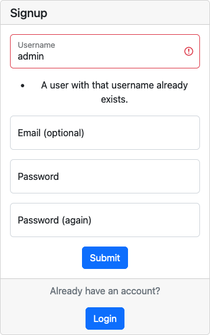
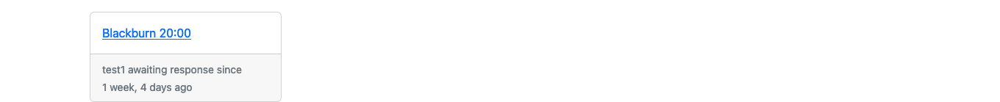
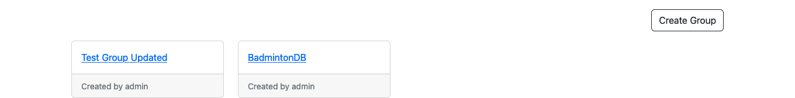

# Cool School

## Features

Web application has the following pages:
- home page
- login page
- registration page
- profile page
- edit profile page
- profile list page
- user profile page
- create group page
- group list page
- group detail page
- update group page
- delete group page
- update group host page
- create session page
- session detail page
- update session page
- delete session page
- update session admin page
- update game score page
- session invite page
- update session players page
- delete session invite page
- user session invite page
- user friend request page
- update session invite page
- update user session invite page
- delete user session invite page
- update friend request page
- delete friend request page

**Navbar**

Navbar has the following links:
- home page
- list view search form
- login

The simplistic design of the navbar is based on the decision to make the use of the webapp easy for the user.

When the user is logged in, the user navbar is displayed.

- 

User Navbar has the following buttons:
- Group Search (which leads to the group list page)
- Group Detail (which leads to specific group page)
- Session Detail (which leads specific session page)
- Session Invites (which leads to logged in users session invites page)
- Find Friends (which leads profile list page)
- Pending Invites (which leads to logged in users friend invites page)
- Profile (which leads to the user profile page)

The user navbar is made of icon with bootstrap tooltip on hover

**Footer**

Footer has the following sections:

- Code copyright on left:

- app logo in center

- links to the GitHub and LinkedIn, and facebook on right:

**Home page**

The Home page has a simple welcome message and a button "get started" which leads to the registration page, from which the user can be redirected to the login page.

- 

Under the hero section, there is a section, which describes the benefits of signing up.

- 

This section has 3 cards, each with a title, a description, and an image.

On the mobile version, the cards are displayed in two rows.

  

After the cards, there are 3 subsections.

1. The first subsection has a text incentive on the left side and an image on the right side.

  

2. The second subsection has a text describing the school's personnel on the right side and an image on the left side.

  

3. The third subsection has a text describing the school's concern about children's health on the left side and an image on the right side.

  

After the subsections, there is an immediate contact section that has an incentive to become a school member right now and a button "get started", which leads to the registration page. The user can be redirected to the login page.

  

**Registration page**

  

This page has a white container with a sign up form, which has a header and input fields for the user to fill in.

In the header of the form, there is a title "Signup".

Under the form's header, there are the following fields:

These fields are required for the user to be filled out.
- Username 
- Email address 
- Password 
- Password confirmation 

If the user leaves an empty field, they will be prompted to fill the required fields

If the user an username already take the username field will be highlighted.

  

If the user types the wrong email address, the email field will be highlighted.

  

If the user enter as email address already used, the email field will be highlighted.

  

If the user typed an incorrect password, the password field will be highlighted.

  

If the user typed an different password in password confirmation, the password confirmation field will be highlighted.

  

underneath the field is the submit form button to create the user profile

the bottom section has a subtitle to guide the users to login if they already have an account.

**Login page**

  

There are two fields which have to be filled out in order to log in:

- Username
- Password

and a remember me option

If the user made a mistake in the username or password, the field will be highlighted.

  

Under the fields, there is a button "Login" which leads user profile page.

Under this button, there is a section which allows the user to sign up .

  
**Profile page**

  

The Profile Page has four container where the user can see his personal information.

The left container contains any session invites the user has received with a badge indicating the number of invites as the profile page id limited to display a few invites

The center container contains the user name a button to edit the user profile and user statistics

the right two container contain a list of friends and the friend invites which are pending

**Edit profile page**

  

It has a container where the user can edit:

- First Name;
- Last Name;

Underneath the fields, there are two buttons, "Cancel" and "Submit." If the user doesn't want to save changes, they can click on the "cancel" button and will be redirected to the profile page. If the user wants to save changes, they can click on the "Submit" button and will be redirected to the profile page.

**User search page**

  

Display all users who have created an account on this application

View created using Django ListView and has pagination when users greater than the paginate_by variable.

A search box will appear for all ListView inherited views
  

Clicking on a user will redirect to view user profile

**User profile page**

  

Display the center container with user statistics and has button on top right corner to add friend is not already friends

If user as a friend request pending the request status will be displayed

  

If the user is friend a button to remove friend will be displayed

  

**Pending Friend request Page**

  

**Update Friend request Page**

  

If the user has sent the friend request you will be able to delete the request

If the user has received the request from another the form will contain a status field which they can approve the request

**Session invite Page**

  

**Update Session invite Page**

  

If the user has requested to join a session the form will be disabled with the option to delete request

If the user has received the invite from another the form will contain a status field which they can approve the invite

**Group List Page**

  

This page will display all groups that the user is currently participating or none private groups

The is a button on the top right which redirects to the create group page

**Group create Page**

  

If the user selects private a disclaimer is displayed

**Group update Page**

  

**Group host change Page**

  

The drop down will be populated with only users that are participating in the group

**Group delete Page**

  

Disclaimer for group delete and two button to confirm deletion or go back

**Group detail Page**

  

The left container will display all participating user in current group and the right contain wil contain a list of sessions in this group with user avatars participating in session.

There is also a button which redirects to create new session in group

**Session create Page**

  

**Session detail Page**

  

has two containers, the left display the users in the session and the right container display a list of games and their respective outcome.

The left contain also contains the session current leader boards

There is a button on the left container to invite more players which redirects to player invite page

If the number of players is greater than 4 the button will display create game and open a modal to select game to play if the user is the session admin

  
if the user is the session admin the left container will contain four links

admin links
- update admin
- update session
- session invites
- delete session

---