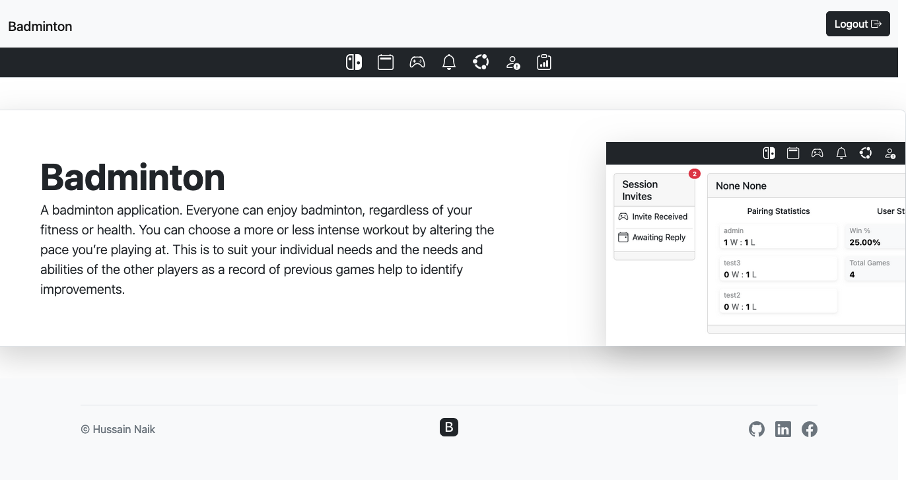

# My Game Stats

Live Version: [My Game Stats](https://pp4-mygamestats.onrender.com/)


Repository: [GitHub Repo](https://github.com/Hussain-Naik/PP4-MyGameStats)

The app is developed by [Hussain Naik](https://github.com/Hussain-Naik).



## Agile Development
The Agile framework is an iterative approach to software development. Instead of delivering a final working product at the end of the development lifecycle, teams work in small timeframes.

### Stage 1: Ideation
Badminton offers a whole host of benefits ranging from increasing life expectancy and mobility to promoting heart health and exercise for all ages and abilities.

While you’re lunging, diving, running and getting your heart pumping, playing a game of badminton can help you burn around 450 calories an hour. The varied movements provide a powerful cardio workout by engaging the entire body, including the hamstrings, quads, calves and your core.

Badminton is a fun and flexible sport that can be enjoyed around your busy schedule. You can even use your workout as an opportunity to socialise and catch-up with friends and family.

Taking part in any form of regular physical activity helps to release our natural feel good happy hormones, endorphins. In turn, this can help reduce depression, anxiety and stress and improve our overall mood and sleep. Talking to other players and rallying in singles or doubles means that badminton is a social sport. This can be particularly beneficial in combating loneliness among older players.

[My Game Stats](https://pp4-mygamestats.onrender.com/) is a badminton application. The main goal help keep users active and socialize while playing badminton. Everyone can enjoy badminton, regardless of your fitness or health. You can choose a more or less intense workout by altering the pace you’re playing at. This is to suit your individual needs and the needs and abilities of the other players as a record of previous games help to identify improvements.

#### Strategy

Developed for all levels of badminton player from beginners to professional, the app is designed to be easy to use and intuitive. The main goal of the app is to help groups organize and keep track of the match outcomes for all participating users.

#### User Stories

##### **First Time Visitor Goals**

| Issue ID    | User Story |
|-------------|-------------|
|[#1](https://github.com/Hussain-Naik/PP4-MyGameStats/issues/1)| As a First Time Visitor, I want create and account to use the application.|
|[#2](https://github.com/Hussain-Naik/PP4-MyGameStats/issues/2)|As a First Time Visitor, I want login to the application.|
|[#3](https://github.com/Hussain-Naik/PP4-MyGameStats/issues/3)| As a First Time Visitor, I want to find and add my friends so i can start organizing a match.|
|[#4](https://github.com/Hussain-Naik/PP4-MyGameStats/issues/4)|As a First Time Visitor, I want to invite my friends to the event i created |
|[#5](https://github.com/Hussain-Naik/PP4-MyGameStats/issues/5)|As a First Time Visitor, I want to create a session to start keeping track of badminton matches for participating players|

##### **Frequent Visitor Goals**

| Issue ID    | User Story |
|-------------|-------------|
|[#6](https://github.com/Hussain-Naik/PP4-MyGameStats/issues/6)|As a Frequent User, I want to accept session invite so i can play with my friends |
|[#7](https://github.com/Hussain-Naik/PP4-MyGameStats/issues/7)|As a Frequent User, I want to view my previous sessions to see my improvement |
|[#8](https://github.com/Hussain-Naik/PP4-MyGameStats/issues/8)|As a Frequent User, I to view the current group scoreboard to see my current progress against all participating players |
|[#8](https://github.com/Hussain-Naik/PP4-MyGameStats/issues/8)|As a Frequent User, I to view the current group scoreboard to see my current progress against all participating players |
|[#9](https://github.com/Hussain-Naik/PP4-MyGameStats/issues/9)|As a Frequent User, the session admin can pass responsibility to another player in the session |
|[#10](https://github.com/Hussain-Naik/PP4-MyGameStats/issues/10)|As a Frequent User, I can select the next match to be played and see who is going to participate |
|[#11](https://github.com/Hussain-Naik/PP4-MyGameStats/issues/11)|As a Frequent User, the admin can enter the match result |
|[#12](https://github.com/Hussain-Naik/PP4-MyGameStats/issues/12)|As a Frequent User, I can manually select the teams for the next match |
|[#13](https://github.com/Hussain-Naik/PP4-MyGameStats/issues/13)|As a Frequent User, I can invite players participating in current group |
|[#14](https://github.com/Hussain-Naik/PP4-MyGameStats/issues/14)|As a Frequent User, I can request to join a open session before |
|[#15](https://github.com/Hussain-Naik/PP4-MyGameStats/issues/15)|As a Frequent User, I can change my profile details |
|[#16](https://github.com/Hussain-Naik/PP4-MyGameStats/issues/16)|As a Frequent User, as the group host i can update the group details |
|[#17](https://github.com/Hussain-Naik/PP4-MyGameStats/issues/17)|As a Frequent User, I want to see all the groups that I am participating in |
|[#18](https://github.com/Hussain-Naik/PP4-MyGameStats/issues/18)|As a Frequent User, as the session admin i can update session details to reflect changes |

---
#### Technologies used

- ##### Languages:
    
    + [Python](https://www.python.org/downloads/release/python-385/): the primary language used to develop the server-side of the website.
    + [JS](https://www.javascript.com/): the primary language used to develop interactive components of the website.
    + [HTML](https://developer.mozilla.org/en-US/docs/Web/HTML): the markup language used to create the website.
    + [CSS](https://developer.mozilla.org/en-US/docs/Web/css): the styling language used to style the website.

- ##### Frameworks and libraries:

    + [Django](https://www.djangoproject.com/): python framework used to create all the logic.
    + [Bootstrap5.2.3](https://getbootstrap.com/docs/5.2/getting-started/introduction/): was used to style and control of the application

- ##### Databases:

    + [SQLite](https://www.sqlite.org/): was used as a development database.
    + [PostgreSQL](https://www.postgresql.org/): the database used to store all the data.

- ##### Other tools:

    + [Git](https://git-scm.com/): the version control system used to manage the code.
    + [Pip3](https://pypi.org/project/pip/): the package manager used to install the dependencies.
    + [Gunicorn](https://gunicorn.org/): the webserver used to run the website.
    + [Psycopg2](https://www.python.org/dev/peps/pep-0249/): the database driver used to connect to the database.
    + [Django-allauth](https://django-allauth.readthedocs.io/en/latest/): the authentication library used to create the user accounts.
    + [Django-bootstrap-v5](https://django-bootstrap-v5.readthedocs.io/en/latest/): was used to control the rendering behavior of Django forms.
    + [Render](https://render.com/): the cloud platform used to host the website.
    + [ElephantSQL](https://www.elephantsql.com/): the cloud database used to store all the data.
    + [GitHub](https://github.com/): used to host the website's source code.
    + [GitHub Projects](https://docs.github.com/en/issues/planning-and-tracking-with-projects/learning-about-projects/about-projects): used for planning and keeping track of issues.
    + [VSCode](https://code.visualstudio.com/): the IDE used to develop the website.
    + [Chrome DevTools](https://developer.chrome.com/docs/devtools/open/): was used to debug the website.
    + [W3C Validator](https://validator.w3.org/): was used to validate HTML5 code for the website.
    + [PEP8](https://pep8.org/): was used to validate Python code for the website.


---

### Stage 2: Development

Github Kanban board was used to keep track of tasks and issues

#### FEATURES

Please refer to the [FEATURES.md](FEATURES.md) file for all features-related documentation.

---

#### Design

The design of the application is based on the Material Design principles.
The central theme of the application is the simplicity of use. Thus, all the components are designed to be easy to use. The minimalistic approach was used to create something meaningful without moving out of focus. As this application is a multifunctional one and consists of many components, the decision to implement white spaces was made as it helps to create a more pleasant user experience. 

##### Color Scheme

The color scheme of the application is based on Bootstrap 5 color scheme:

  [Color Scheme](https://getbootstrap.com/docs/5.2/customize/color/#using-the-new-colors)

As it may be noticed, the color scheme is based on the Material Design principles as well. The navbar is simple dark text on bootstraps light background while user navigation is the inverse light text on the dark background.

In Summary the Bootstrap 5 color scheme allows the application to be visually appealing and consistent in the design while reinforcing the applications identity to enhance the overall user experience.

##### Typography

As the application is designed using Bootstrap 5 library entirely the decision to stay with the bootstrap typography for its consistency as is uses a native font stack that selects the best font-family for each OS and device

[Typography](https://getbootstrap.com/docs/5.2/content/typography/)

##### Imagery

- The main part is allocated to the use of icons from [Bootstrap](https://icons.getbootstrap.com/) website. The use of icons is essential for the user experience when it comes to multifunctional websites.


##### Wireframes

- [Desktop Wireframes](documentation/desktop_wireframe.pdf)
- [Mobile Wireframes](documentation/mobile_wireframe.pdf)

---

#### Information Architecture

##### Database

* During the earliest stages of the project, the database was created using SQLite.
* The database was then migrated to PostgreSQL.

##### Entity-Relationship Diagram

* The ERD was created using [django-extensions](https://django-extensions.readthedocs.io/en/latest/index.html).

- [Database Scheme](documentation/final_db.pdf)

##### Data Modeling

1. **Allauth User Model**
    - The user model was created using [Django-allauth](https://django-allauth.readthedocs.io/en/latest/).
    - The user model was then migrated to PostgreSQL.

2. **Profile Model**

It was created in order to provide more room for manipulation of the database and provide opportunities for future developments.

| Name          | Database Key  | Field Type    | Validation |
| ------------- | ------------- | ------------- | ---------- |
| User          | user          | OneToOneField | User, on_delete=models.CASCADE, related_name='profile'    |
| First Name    | first_name    | CharField    | max_length=25, null=True, blank=True      |
| Last Name     | last_name     | CharField    | max_length=25, null=True, blank=True      |
| friends       | friends       | ManyToManyField | to=Profile, blank=True      |

3. **FriendRequest Model**
It was created to keep track of user friend requests.

| Name          | Database Key  | Field Type    | Validation |
| ------------- | ------------- | ------------- | ---------- |
| Sender          | sender          | ForeignKey | Profile, on_delete=models.CASCADE,related_name='friend_request_from_profile'    |
| Receiver    | receiver    | ForeignKey    | Profile, on_delete=models.CASCADE, related_name='friend_request_to_profile'      |
| Status     | status     | CharField    | max_length=8, choices=STATUS_CHOICES      |
| Sent On       | sent_on       | DateTimeField | auto_now_add=True      |
| Updated       | updated_on       | DateTimeField | auto_now=True      |

```Python
    # Status to assign to friend request
    STATUS_CHOICES = (
        ('send', 'send'),
        ('accepted', 'accepted'),
    )
```
4. **SessionInvite Model**
It was created to keep track of session invites. 

| Name          | Database Key  | Field Type    | Validation |
| ------------- | ------------- | ------------- | ---------- |
| Session          | session          | ForeignKey | Session, on_delete=models.CASCADE,related_name='session_invite'    |
| Receiver    | receiver    | ForeignKey    | Profile, on_delete=models.CASCADE, related_name='session_invite_receiver'      |
| Inbound     | inbound     | BooleanField    | default=False      |
| Status     | status     | CharField    | max_length=8, choices=STATUS_CHOICES      |
| Sent On       | sent_on       | DateTimeField | auto_now_add=True      |
| Updated       | updated_on       | DateTimeField | auto_now=True      |

```Python
    # Status to assign to session invites
    STATUS_CHOICES = (
        ('pending', 'pending'),
        ('accepted', 'accepted'),
        ('declined', 'declined'),
    )
```
5. **Group Model**
It was created to allow users to view available groups and see who is participating

| Name          | Database Key  | Field Type    | Validation |
| ------------- | ------------- | ------------- | ---------- |
| Name          | name          | CharField | max_length=30, unique=True, blank=False    |
| Host    | host    | ForeignKey    | User, on_delete=models.CASCADE, related_name='group_author'      |
| Private     | private     | BooleanField    | default=False      |
| Created At       | created_at       | DateTimeField | auto_now_add=True      |
| Updated At       | updated_at       | DateTimeField | auto_now=True      |

6. **Session Model**
It was to created to model the badminton session users have. Due to my circumstance this model functionality was reduced to model only doubles badminton games

| Name          | Database Key  | Field Type    | Validation |
| ------------- | ------------- | ------------- | ---------- |
| Location          | location          | CharField | max_length=30, blank=False    |
| Time          | time          | CharField | max_length=30, blank=False    |
| Group    | group    | ForeignKey    | Group, on_delete=models.CASCADE, related_name='sessions'      |
| Players    | players    | ManyToManyField    | User, through='Roster', related_name='session'      |
| Admin    | admin    | ForeignKey    | User, on_delete=models.DO_NOTHING, related_name='session_admin'      |
| Joinable     | joinable     | BooleanField    | default=True      |
| Status     | status     | IntegerField    | choices=STATUS, default=1      |
| Game Type     | game_type     | IntegerField    | choices=GAME_TYPE, default=1      |
| Team Selection     | team_selection     | IntegerField    | choices=TEAM_TYPE, default=1      |
| Created At       | created_at       | DateTimeField | auto_now_add=True      |
| Updated At       | updated_at       | DateTimeField | auto_now=True      |

```Python
    # Status to assign to session invites
    STATUS = (
    (1, 'open'),
    (2, 'in progress'),
    (3, 'completed'),
    )
    GAME_TYPE = ((1, 'Doubles'))
    TEAM_TYPE = ((1, 'Random'))
```

7. **Roster Model**
It was created in order to provide more room for manipulation of the database and provide opportunities for future developments. Utilized a django through model as each player in a session will required additional field data like the seed position and session winner.

| Name          | Database Key  | Field Type    | Validation |
| ------------- | ------------- | ------------- | ---------- |
| Player    | player    | ForeignKey | User, on_delete=models.DO_NOTHING, related_name='roster'    |
| Session   | session   | ForeignKey | Session, on_delete=models.CASCADE, related_name='session_roster'    |
| Roster    | roster    | IntegerField    |  |
| Winner    | is_winner | BooleanField    | default=False      |


8. **Team Model**
It was created in order to provide more room for manipulation of the database and provide opportunities for future developments. This table to save pairing of user when playing team matches

| Name          | Database Key  | Field Type    | Validation |
| ------------- | ------------- | ------------- | ---------- |
| Team Players    | team_players    | ManyToManyField | User, related_name='team'   |

9. **Game Model**
It was created in order to provide more room for manipulation of the database and provide opportunities for future developments and model the match aspect of badminton.

| Name          | Database Key  | Field Type    | Validation |
| ------------- | ------------- | ------------- | ---------- |
| Increment    | inv    | IntegerField | default=0   |
| Type    | creation_type    | CharField | max_length=8, choices=STATUS_CHOICES, default='sequence'  |
| Session    | session    | ForeignKey | Session, on_delete=models.CASCADE, related_name='session_games', null=True  |
| Team    | team    | ManyToManyField | Team, through=Fixture   |

10. **Fixture Model**
It was created in order to provide more room for manipulation of the database and provide opportunities for future developments. This table to save pairing match up outcome and score

| Name          | Database Key  | Field Type    | Validation |
| ------------- | ------------- | ------------- | ---------- |
| Team    | team    | ForeignKey | Team, on_delete=models.CASCADE, related_name='team_fixture'   |
| Game   | game   | ForeignKey | Game, on_delete=models.CASCADE, related_name='game_fixture'   |
| Score   | score    | IntegerField | default=0   |
| Winner    | is_winner    | BooleanField | default=False   |

10. **Matchup Model**
It was created in order to provide more room for manipulation of the database and provide opportunities for future developments. This table is used to simulate the matches sequences to find out who is playing who

| Name          | Database Key  | Field Type    | Validation |
| ------------- | ------------- | ------------- | ---------- |
| Player Count    | player_count    | IntegerField |   |
| Game Index   | game_index   | IntegerField |    |
| Team 1 Player 1   | team1_player1    | IntegerField |    |
| Team 1 Player 2    | team1_player2    | IntegerField |  |
| Team 2 Player 1   | team2_player1    | IntegerField |   |
| Team 2 Player 2    | team2_player2    | IntegerField |    |

---

### Stage 3: Testing

#### Testing

Please refer to the [TESTING.md](TESTING.md) file for all test-related documentation.

---

### Stage 4: Deployment

#### Deployment

- The app was deployed to [Render](https://render.com/).
- The database was deployed to [ElephantSQL](https://www.elephantsql.com/).
- The app can be reached by the [link](https://pp4-mygamestats.onrender.com/).

Please refer to the [DEPLOYMENT.md](DEPLOYMENT.md) file for all deployment-related documentation.

---

### Stage 5: Operations
Due to government changes to ILR application from april 2024 I have had to reduce the functionality to complete the project within the given timeframe.

#### Future Improvements and Features

**Singles Badminton**

In the future I would like to implement the singles badminton functionality

**Custom Team Selection**

In the future I would like to implement the functionality to allow sessions to create custom teams

**Sign-up and Login options**

In the future I would like to add sign-up and login with Facebook, Google, and other social media platforms.
Also, I would like to add an option to use a phone number instead of an email and send a verification code to the user's phone.

**Asynchronous functionality**

In the future I would like to make the application asynchronous. So all elements in the frontend will be updated real-time as soon as the backend sends the data.

**Security improvements**

In the future I would like to make the application foolproof against attacks and security vulnerabilities.

**User settings**

In the future I would like to more customization options for the user.

**Group chatting**

In the future I would like to add group chatting for friends and groups.

**Tournament Mode**

In the future I would like to add Tournament style games.

**User search preference**

In the future I would like to add user setting to display preferred location or time slots.


---

## Credits

- [GitHub](https://github.com/) for giving the idea of the project's design.
- [Django](https://www.djangoproject.com/) for the framework.
- [Render](https://render.com/): for the free hosting of the website.
- [ElephantSQL](https://www.elephantsql.com/): for the free hosting of the database.
- [Bootstrap 5](https://fontawesome.com/): for the a free HTML, CSS, and JavaScript framework for creating responsive, mobile-first websites
- [Postgresql](https://www.postgresql.org/): for providing a free database.
- [w3schools.com](https://www.w3schools.com/): for providing a free learning material
- [Responsive Viewer](https://chrome.google.com/webstore/detail/responsive-viewer/inmopeiepgfljkpkidclfgbgbmfcennb/related?hl=en): for providing a free platform to test website responsiveness
- [Favicon Generator. For real.](https://realfavicongenerator.net/): for providing a free platform to generate favicons.

*All names are fictional, and any resemblance to actual events or locales or persons, living or dead, is entirely coincidental.*

---

## Acknowledgments

- First and foremost Alhamdulillah which is acknowledgement and thankful to Allah for guiding me with understanding and knowledge, while keeping me sane and calm during the project. 
- [Kieron From Student Care](https://codeinstitute.net/blog/meet-our-support-teams/?nab=1&utm_referrer=https%3A%2F%2Fwww.google.com%2F), was a great help and advised support during my difficult circumstance due to the changes introduced by the government for ILR application
- [Aleksei Konovalov](https://github.com/lexach91), my mentor, who guided me and advised to undertake this project.
- [Iuliia Konovalova](https://github.com/IuliiaKonovalova), my mentor, who guided me through the development of the project with his advice.
- My current workplace for providing me with the support and motivation to work on the application.
- My Weekly Badminton sessions with my friends who's support and criticism has been the push I needed to complete this project


